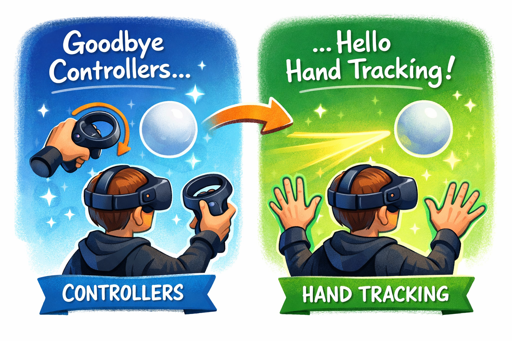

+++
date = '2026-01-06T09:38:16+01:00'
draft = false
title = 'Winter Break and New year week: When Physics Starts Messing With My Hands'
+++

Last week (Week 6) I finally got the AvatarRoot + camera setup working and a very baby version of left-hand **controller** tilt movement. It moved, it kinda listened, and it also made me dizzy if I tested too long. So for the next weeks the goal was basically: make this feel less like a rollercoaster ride and more like something I can actually have fun with.

Also, very important change that happened here: I switched from controllers to hands.

### <u><strong>Goodbye controllers, hello hand tracking</strong></u>



Until now I was only using the Quest controllers. All the “tilt” logic was reading the controller rotation. That was easier for me to understand at first, and also it was closer to how the original repo works.

But then after pitching my idea in class Professor asked me plainly why I am not using just hands, it made me think cause honestly till then that idea did not even come to me. Maye its because of my lack of experience in VR but I thought that I should at least try full hand tracking instead of driving everything with two plastic sticks.

So I turned on hand tracking in the Oculus/OVR settings, and added `OVRHand leftHand` and `OVRHand rightHand` references to my `LocomotionTechnique` script. Then I changed the rotation code so that, if hand tracking is enabled and the hand is tracked with good confidence, I use `leftHand.transform.rotation` instead of the controller’s rotation. I kept the controller logic as a fallback, because hand tracking can randomly fail (lighting, me doing weird poses, etc.) and I didn’t want the avatar to act glitchy and weird while testing.

I also started using pinch strength to detect a gesture. If all four non-thumb fingers on the left hand have pinch strength above a threshold, I count that as a “left fist”. I hooked that into calibration:

left fist → call `CalibrateLeftNeutral()` → reset movement.

So now I don’t need to click the X button every time. I can just clench my hand and the system understands “ok neutral pose changed”.

The first time the VR skeleton hands showed up and the avatar responded to my actual hand tilt, it felt pretty magical. Also slightly cursed, because tracking is not always stable and honestly very janky.

From here on, when I say “left hand” / “right hand”, I mostly mean the real tracked hands. Controllers are still there as backup, but the main idea is now controller free airbending.

### <u><strong>Left hand: the drunk phase</strong></u>

The core idea stayed the same: hold left hand in front, tilt, avatar glides.

In practice this turned into: why does the avatar act like a typical person coming out of a bar at 10pm on a saturday??

I tried to make the movement feel more “analog”(I am still holding onto this cause i have grown up playing games and this is what is coming to me naturally) and smooth. 
So I added stuff like 

* deadzone for tiny tilts
* tiltGain to exaggerate angles
* maxSpeed so it doesn’t fly away, and also 
* acceleration/drag so it feels like it’s gliding instead of snapping. 

It did work, but it was super moody. Some days a tiny tilt would suddenly send the avatar off faster than expected. Other times I tilt a lot and it still felt lazy. The numbers were never stable enough for me to trust. :crying_cat_face:

This is the moment where I finally understood why people say “game feel matters”. The maths can be correct and still your brain goes “nope”.

Hand tracking also made the random movement problem worse, because my hands are always doing something. Scratching face, resting on lap, drifting out of view, coming back in, etc. Even if I don’t mean to steer, the system is like “ah yes, input”.

So I wrote to myself: I think I’m trying too hard to make it physically clever. I should first make it predictable and game-like. Only then I can add fancy stuff again.

### <u><strong>Right hand: We have a lift off (and why it sucked)</strong></u>

At the same time I started experimenting with right hand for vertical movement. The idea is simple: avatar sits on airball, so right hand should create “air lift”.

The first idea was: swirl your right hand like a cowboy spinning a rope and you build up lift. So I tracked right-hand position, computed velocity, measured how quickly the velocity direction changes (how “circular” it is), and combined that into a swirlStrength. That fed into a liftGauge which reduces over time. In physics I applied upward acceleration proportional to the gauge.
```csharp

Vector3 prevPos;
float liftGauge = 0f;
Vector3 prevVelDir = Vector3.forward;

void Update()
{
    // 1) estimate right-hand velocity from position change
    Vector3 pos = rightHand.transform.position;
    Vector3 vel = (pos - prevPos) / Mathf.Max(Time.deltaTime, 1e-4f);
    prevPos = pos;

    float speed = vel.magnitude;
    if (speed < 0.05f) return;

    // 2) how “circular” is the motion? (direction changing fast = more swirl)
    Vector3 velDir = vel.normalized;
    float ang = Mathf.Acos(Mathf.Clamp(Vector3.Dot(prevVelDir, velDir), -1f, 1f)); 
    float angPerSec = ang / Mathf.Max(Time.deltaTime, 1e-4f);
    prevVelDir = velDir;

    // 3) swirl strength + gauge (build up + decay)
    float swirlStrength = Mathf.Clamp01((speed * angPerSec) / 5f); // 5f = random scale
    liftGauge = Mathf.Clamp01(liftGauge + swirlStrength * Time.deltaTime);
    liftGauge = Mathf.MoveTowards(liftGauge, 0f, 0.6f * Time.deltaTime); // decay
}

void FixedUpdate()
{
    // 4) apply smooth upward acceleration based on gauge
    float upAccel = liftGauge * maxLiftAccel;
    avatarBody.AddForce(Vector3.up * upAccel, ForceMode.Acceleration);
}
```

In my head and in theory this was very cool: you charge air in a circle and the ball softly rises.

In reality it turned into a tiny trampoline. Even small accidental right-hand motion kept the gauge slightly above zero, which meant the avatar was always bouncing a little bit. When combined with left-hand movement it became: forward – boing – forward – boing. Like climbing an invisible staircase. With a headset on, this is not funny after 10 seconds.




Somewhere in the middle I also tried a side experiment: right fist to charge and open to release an upward impulse. It worked but felt wrong. It was tiring and it looked strange. So I deleted it.

> **Note to future me:**  
> It’s ok to throw away ideas. The code is not sacred. Maybe its not the 1 grade point that I will get but the real treasure was knowing what doesnt work for sure.

After a few rounds of this I basically had a comfort  check. In VR, weird physics + head movement + camera movement = nausea. So I stopped trying to be clever and decided to make things simple. Long time coming if you ask me.

### <u><strong>Pre-Christmas cleanup: making it feel like a game</strong></u>

This week I didn’t want to add ten new features. I just wanted the existing controls to feel less chaotic. So I decided to stop being fancy and simplify everything.

### <u><strong>Left hand: from analog mess to two clear states</strong></u>

The analog speed idea was cool in theory, but in practice it always felt inconsistent. So I simplified it into basically a switch:

If tilt is below threshold → no movement.  
If tilt is above threshold → move at a fixed speed.

Now it behaves more like “I am moving” vs “I am not moving”. Instantly more easy to use.

I also changed how I decide the direction. Earlier I was thinking too much in world axes. Now I map movement relative to where I’m facing (and later also head yaw, see below). So tilt forward moves forward, tilt right gives clean strafe right, diagonals actually feel like diagonals.

I still kept a small physics-y part for feel, so it accelerates into motion and glides a bit instead of snapping instantly. But overall the important part is: it’s predictable now.
```csharp
// LEFT HAND 

// 1) measure tilt (compare current hand "up" vs neutral "up" on XZ plane)
Vector3 upNow = leftHandRotation * Vector3.up;
Vector3 tilt = new Vector3(upNow.x - upNeutral.x, 0f, upNow.z - upNeutral.z);
float tiltMag = tilt.magnitude;

if (tiltMag < moveTiltThreshold)
{
    targetHorizVel = Vector3.zero;          // OFF
}
else
{
    Vector3 tiltDir = tilt.normalized;

    // 2) get forward/right based on where I’m facing (yaw only)
    Quaternion yawOnly = HeadYawOnly();     // from HMD 
    Vector3 fwd   = (yawOnly * Vector3.forward).XZ().normalized;
    Vector3 right = (yawOnly * Vector3.right).XZ().normalized;

    // 3) convert tilt direction into move direction 
    float f = Vector3.Dot(tiltDir, fwd);
    float r = Vector3.Dot(tiltDir, right);
    Vector3 moveDir = (fwd * f + right * r).normalized;

    targetHorizVel = moveDir * moveSpeed;  // ON (fixed speed)
}

// 4) smooth acceleration
horizVel = MoveTowards(horizVel, targetHorizVel, moveAccel * dt);
avatarBody.linearVelocity = new Vector3(horizVel.x, avatarBody.linearVelocity.y, horizVel.z);
```

### <u><strong>Backwards walking = discomfort, so I nerfed it</strong></u>

One thing I noticed quickly: fast backwards movement in VR feels horrible. So I added a small comfort rule: if the intended direction is mostly backwards, multiply speed by a backwardSpeedMultiplier (like 0.4). So straight back is intentionally slow. Diagonal back can still be ok.

It sounds like a tiny detail, but it reduced a lot of weird movements that are not even intended.

### <u><strong>Right hand: air jumps instead of continuous lift</strong></u>

Big change on the right hand: I scrapped the lift gauge and made it discrete.

New idea: one strong swirl / whip motion → one clean upward pop. Then a cooldown so you can’t spam it.

Under the hood I still track hand velocity and check if it’s fast enough, direction changes fast enough, and mostly horizontal (because I want rope motion, not up-down flapping). If it qualifies, I apply an impulse:

```csharp
avatarBody.AddForce(Vector3.up * swirlLiftImpulse, ForceMode.VelocityChange);
```
Then I clamp max upward velocity so I don’t launch into VR space. The result feels much nicer. Nothing happens when I casually move my right hand. One deliberate swirl gives one jump. It feels like an actual mechanic.



### <u><strong>Turning corners without fighting the track</strong></u>
One sneaky problem with third-person movement on the parkour track is corners. If the road turns 90 degrees and my movement reference is only avatar forward, then I end up kind of strafing down the new road instead of moving forward, because the avatar forward is still the old direction.

So I let head yaw help here. When I look into the new road segment, head yaw changes. I use that yaw to decide what “forward” should be for the tilt mapping. So I can look into the next segment, tilt forward again, and the avatar moves into the turn naturally.

It’s basically: “where I look is where I mean to go next”. The camera still stays behind the avatar, but the direction mapping respects my attention, which made 90° and 180° turns feel way better.



## <u><strong>What’s next</strong></u>
So right now this phase ended with:

Left hand = predictable movement (two states).
Right hand = clicky air jumps .
Turning corners 

Next up is the other half of the problem: the parkour game still doesn’t fully see my air bender boy on an air scooter. The banners, coins and mini object-interaction tasks were written for the original first-person rig. Now that my capsule avatar is the “real” body, I need to make sure the rest of the level recognizes it again. For some reason the coins does not trigger when i enter the start pole. Well a problem for another day.

Cheers,
– Ajay