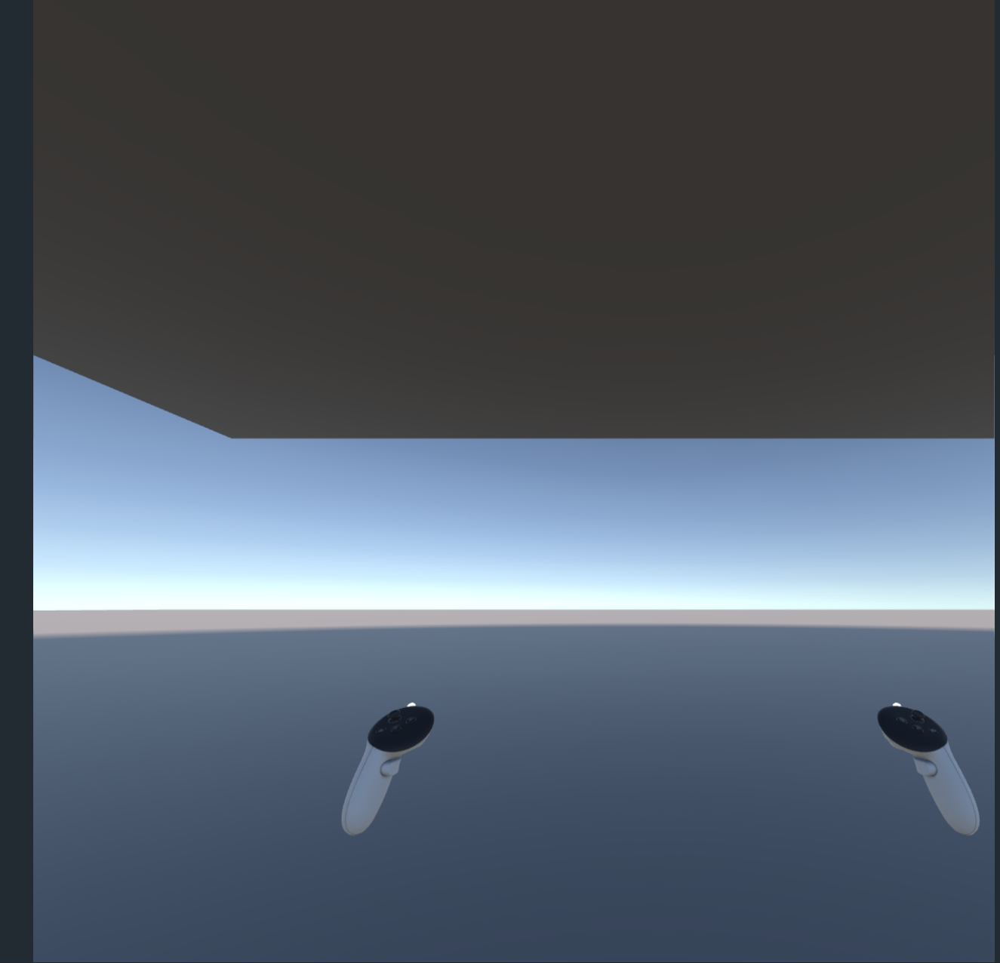
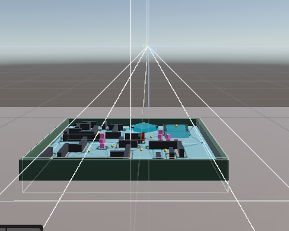

I decided to post only when I hit a real milestone instead of spamming daily logs. This one bundles a few action-packed days.

1) Enemies + first chaos

I added an enemy that chases the player ball using a `NavMeshAgent`. Looked great… until it started orbiting me and occasionally ghosted through walls.

**Reason**:My enemy had a visible child (EnemyBody) offset from the parent that holds the `NavMeshAgent`.
**Fix**: created a clean hierarchy Enemy (parent with Agent) → EnemyBody (mesh), then Reset the child to (0,0,0).

**Reason**:The NavMesh bake was ignoring thin walls.
**Fix**: I re-baked the mesh after reducing the Voxel Size from the advanced mesh settings. My walls were very thin since I wanted to make it like Pacman.

Sooooo I also made the enemy spin its visual child while the agent moves the parent. Looks spooky without breaking pathfinding.



2) Pac-Man Time: building a maze

I wanted corridors instead of a plain arena. I started with ProBuilder, then switched to vanilla Unity cubes because duplicating with grid-snap was faster for me. I mainly reverted this thinking the abov problem with enemy going through walls was a ProBuilder issue. but i solved th above issue after doing all the reverting to normal unity Cubes. So i did not go back. But honestly ProBuilder is so much easier to work with.

   - One shared material for all wall cubes (fewer draw calls).

   - Grouped everything under MazeUnity to move/scale it as one thing.

3) VR scene setup 

I moved this into VR with the OVR Interaction Rig.

My first playtest was… the table was way above my head. Turns out I had a big cube for the table and set Y to the tabletop height without accounting for half the scale in Y. The plane and table setup scale and position was way off too.

**Fixes**:

   - Put Plane at Y = 0 for ground.

   - Made a thin table (Scale Y = 0.05) and set Y so the top is just above the plane.

   - Kept the rig at (0,0,0), Tracking Origin = Floor Level, and recentered in the headset.

   - Moved all gameplay under a GameplayRoot so I could nudge the whole board up/down without wrecking relative positions.

5) Shrinking the whole game

I wanted a miniature board on the table, so I scaled the maze down to 0.2.
That broke the NavMesh again (walls became “too thin” for the original bake).

The bake recipe that finally worked:

   - Created a tiny Agent Type for the enemy ( Radius 0.10, Height 0.40).

   - On NavMesh Surface: Override Voxel Size to about world-scale × 0.2 of my previous value.

   - Lowered Minimum Region Area .

6) Win/Lose Mechanic

Simple lose flow: when enemy collides with the ball, reset pickups, show “You Lose,”.



Same thing for win. If the player collects all 11 pickup gameobjects before the enemy catches you then "You Win" is displayed along with the time it took to complete it. The enemy gameobject gets destroyed too



7) Build to Meta Quest

   - Switched platform to Android and basically followed all of Yaras guidelines to finish setting up unity to build an apk i can use in the Quest.

   - Built the apk and installed and configured **SideQuest** to sideload the newly created apk and run it.

   - App appears under Unknown Sources and runs fine.

What’s still broken (for next post)

Everything is running on the headset 🎉, but there’s one bug left: when the enemy touches the player, the player isn’t destroyed and no “Game Over” text shows. The UI and reset logic work in my non-VR version of the game tests, so I’ll debug and fix it in the following post.