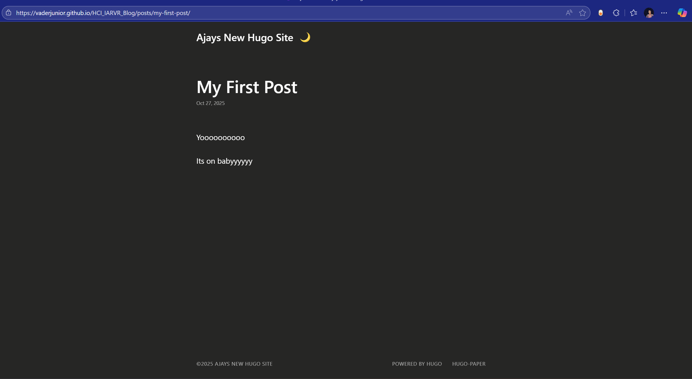

+++
date = '2025-10-28T17:33:36+01:00'
draft = false
title = 'Day 1: Setting up Unity, Meta tools, and starting the RollaBall game'
+++

Phew, today was long but really productive.

I started by factory resetting the headset because it was still logged into an old account. I wanted to use my own Meta account, so I set it up again. After that I tried it out for a bit and let my friends do the same. My roommate played bowling in VR and we all had a good laugh.

Later I moved on to learning Unity and some C#, both completely new to me. Before that, I had finished setting up this Hugo website yesterday. I first tried a fancy theme, but it needed too many extra things, so I switched to the Paper theme that Yara recommended. It was simple and worked right away.

### RollaBall

The RollaBall project was provided on Moodle, but I wanted to understand it better, so I followed the official Unity tutorial:

https://learn.unity.com/project/roll-a-ball

I reached the part where the ground and ball are set up.



Everything was going fine until I pressed Play and the ball just stayed there.  
No errors, no movement.

I tried changing the speed, reimporting input settings, and even searched online for answers. After about 25 minutes I finally realized that I never pressed the arrow keys to move the ball. I had just been staring at it, waiting for it to move by itself. Lesson learned.

After that I set up the camera to follow the ball and added walls so it wouldn’t fall off the platform. The next step is to add the collectibles and finish the rest of the tutorial.

I also added Oculus support in Unity. The setup was straightforward, but I’ll explore that more once the basic game is done.

That’s all for today.
